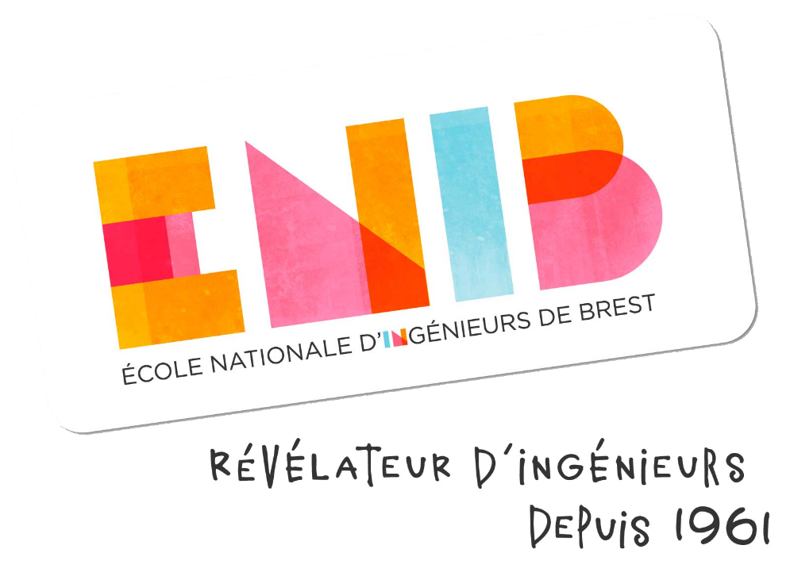

    
    <h1>
        <b style="color:black">
            ENIB S7
        </b>
    </h1>
    <h3>Mon dépôt du semestre 7 (CAI)</h3>

### Sur ce dépôt, on y trouve l'ensemble de mes travaux que j'ai réalisé au cours du semestre 7 à l'ENIB.
Ce semestre était axé sur la découverte de conception d'IHM (Interface Humain Machine). Ainsi de nombreux projet sont présent sur ce depôt et ont été réalisé afin de découvrir les différentes bibliothèques et méthodes qui permettent de construire une bonne interface graphique.

Voici une courte présentation des différents projets dispo sur le depôt. 

    
    <h1>
        <b style="color:#3E4751">
            Osciloscope
        </b>
    </h1>

> Cette application permettait de nous introduire la méthode MVC ainsi que les IHM à l'aide de __TkInter__.     
Il s'agissait d'une petite application qui devait afficher plusieurs courbes dans un graphique. Chaque courbe étaient modifiable via des curseurs.     
On pouvait ensuite sauvegarder nos différentes courbes (sauvegarder le projet) pour pouvoir y revenir plus tard.

    
    <h1>
        <b style="color:#FF3800">
            Simply Paint
        </b>
    </h1>
    <h3>Paint fast, Paint simply !</h3>

> Une courte application graphique permettant de créer facilement et rapidement un dessin. Il est possible dans cet éditeur de pouvoir modifier à chaque instant l'ensemble des figures (dimension, couleur, ...).  
L'application est réalisé avec la bibliothèque de __Qt__ à l'aide de __PyQt5__.

    
    <h1>
        <b style="color:rgba(38,190,168,1)">
            Eliacube Animation
        </b>
    </h1>
    <h3>The famous animation of the artefact named "Eliacube" in Wakfu animation series !</h3>

    

> Une simple animation web d'un cube en 3D pour pratiquer les transformations et animations web en 3D.
Utilisation des languages suivant: __HTML__ et __CSS__.
